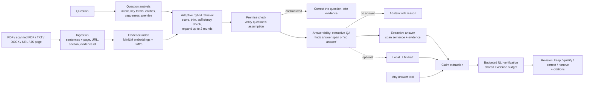

# Claim-Aware Adaptive RAG

A locally runnable retrieval-augmented question-answering system that:

- answers questions **only from your documents and webpages**, citing the exact sentence (and PDF page) behind every statement;
- retrieves evidence **adaptively**, expanding or trimming the evidence set per question, and **abstains** when the evidence does not contain an answer;
- **verifies every claim** against the sources with an NLI model and labels it SUPPORTED, PARTIALLY_SUPPORTED, CONTRADICTED, INSUFFICIENT_EVIDENCE or UNCERTAIN;
- checks the **assumptions inside questions** ("Why did X happen?" when X did not happen);
- **revises any answer text** (from a chatbot, or from the optional local LLM) so that only source-supported statements remain as facts;
- spends verification effort under a **shared evidence budget**, stopping early on settled claims.

> The system measures agreement with the provided sources as judged by NLI and QA models. It does **not** establish real-world truth and does **not** eliminate hallucinations; it detects and removes many unsupported statements, with the error rates reported in §7.

---

## 1. Motivation and problem

Standard RAG pipelines retrieve a fixed top-k set of passages and hand them to a generator. Four problems follow:

1. **Fixed k is wrong for most questions**: too few passages for multi-part questions, too many irrelevant ones for simple lookups, and no signal when the answer is absent.
2. **Answers are not checked claim by claim**: a fluent answer can mix supported facts with unsupported or contradicted ones.
3. **Support is not relevance**: a sentence can be true according to the sources yet not answer the question.
4. **Verification is expensive**: checking every claim against every passage costs many NLI calls, though most claims are settled by the first one or two passages.

**Research idea:** combine adaptive, question-aware retrieval with claim-level verification under a shared evidence budget, to improve evidence-grounded answering and reduce unsupported claims.

## 2. Architecture



| Module | Responsibility |
|---|---|
| [carag/ingestion.py](carag/ingestion.py) | PDF (per page; **OCR fallback for scanned pages**), TXT/MD, DOCX (including tables), webpages (article text with navigation and reference lists removed; PDF URLs; **headless-browser fallback for JavaScript-rendered pages**). Heading detection, hyphenation repair, sentence splitting, de-duplication, clear `IngestionError`s. |
| [carag/index.py](carag/index.py) | Sentence embeddings computed once per source, built-in BM25, evidence-type flags (causal, comparison, numeric, limitation), neighbour links. |
| [carag/query.py](carag/query.py) | Rule-based question analysis: intents, key terms, named entities, vagueness, declarative premise extraction. |
| [carag/retrieval.py](carag/retrieval.py) | Hybrid scoring and adaptive selection. |
| [carag/relevance.py](carag/relevance.py) | Extractive QA: locates the answer span and decides answerability. |
| [carag/claims.py](carag/claims.py) | Conservative claim extraction (attribution phrases stripped); causal decomposition ("A because B"). |
| [carag/verification.py](carag/verification.py) | NLI-based claim labelling rules. |
| [carag/budget.py](carag/budget.py) | Shared evidence budget with evidence-gain-aware scheduling. |
| [carag/answering.py](carag/answering.py) | Grounded extractive answering, premise checks, answerability, abstention, citations. |
| [carag/revision.py](carag/revision.py) | Hallucination prevention: rewrites answer text from claim verdicts. |
| [carag/generation.py](carag/generation.py) | Optional local LLM drafting (experimental). |
| [carag/pipeline.py](carag/pipeline.py) | `ClaimAwareRAG` facade used by the CLI, the UI and the evaluation. |
| [carag/config.py](carag/config.py) | All thresholds in one place. |
| [app.py](app.py) | Streamlit UI. |
| [evaluation/](evaluation/) | Metrics, datasets and evaluation scripts. |
| [evidence_allocator.py](evidence_allocator.py) | The original prototype CLI, kept unchanged for reference. |

## 3. Models

| Model | Size | Role | Why |
|---|---|---|---|
| `sentence-transformers/all-MiniLM-L6-v2` | ~90 MB | Sentence embeddings for retrieval and evidence relevance | Existing project model; fast on CPU and GPU. |
| `cross-encoder/nli-deberta-v3-base` (default) | ~740 MB | Entailment / contradiction / neutral probabilities for claim verification | **Measured better** than the original `-small`: SciFact macro-F1 0.649 vs 0.590, synthetic 0.966 vs 0.865 (§7.3). |
| `cross-encoder/nli-deberta-v3-small` (option) | ~550 MB | Lower-memory alternative | The original project model. |
| `deepset/minilm-uncased-squad2` | ~130 MB | Answer-span extraction and answerability ("does the evidence answer the question?") | Added because verification cannot detect supported-but-irrelevant answers. It cut false answers on SQuAD 2.0 from 65% to 21% (§7.4). |
| `Qwen/Qwen2.5-0.5B-Instruct` (optional, off by default) | ~1 GB | Generative answer drafts, which are then verified and revised | Smallest instruction model that fits beside the others in 4 GB of VRAM. It measured **worse** than the extractive answerer (§7.6), so it is experimental. |

No paid APIs and no cloud services are used. Models download from Hugging Face once; after that, document processing runs offline.

**Measured resource use** (RTX 3050 Laptop 4 GB, Windows 11): with the default configuration, peak GPU memory is 1.0 GB and answers take ~0.15 s each on GPU or ~0.47 s on CPU. With the optional LLM, peak GPU memory is 1.9 GB and answers take ~0.7 s. Peak process RAM was 4.2 GB, measured with GPU and CPU copies of all models loaded at once; single-device use is lower. Models load lazily, once per process, and are shared across UI sessions. The GPU is used automatically when available, with automatic CPU fallback, including on GPU out-of-memory.

## 4. Installation

Tested on **Python 3.14.3** (GPU, CUDA 12.6) and **Python 3.12.14** (CPU-only PyTorch): all 66 tests pass on both.

```bash
cd claim-aware-adaptive-rag
python -m venv .venv
source .venv/Scripts/activate        # Git Bash;  .venv\Scripts\activate in cmd/PowerShell

# PyTorch first: CUDA 12.6 build (NVIDIA GPU) ...
pip install torch --index-url https://download.pytorch.org/whl/cu126
# ... or CPU-only:  pip install torch --index-url https://download.pytorch.org/whl/cpu

pip install -r requirements.txt
python -m playwright install chromium    # optional: JavaScript-rendered webpages
```

`requirements.txt` includes the optional OCR packages (`pypdfium2`, `rapidocr`, `onnxruntime`) and `playwright`. If they are missing, the system still works; it reports that scanned pages or JavaScript pages cannot be read and explains how to enable them. Webpage ingestion and downloading the evaluation datasets need internet access.

## 5. Usage

### Web interface

```bash
streamlit run app.py
```

1. **Add sources:** upload PDF/TXT/DOCX files and/or enter a URL. A table shows each source, its sentence count and any warnings (e.g. OCR used).
2. **Ask** tab: type a question. You get the short answer, the answer sentences with numbered citations, and three tabs:
   - **Claim checks:** a label and supporting or contradicting evidence for each claim, and for the question's assumption;
   - **Retrieved evidence:** scores for each retrieved sentence;
   - **How retrieval worked:** the expansion/trimming trace and evidence-budget use.
   The *Local LLM draft (experimental)* toggle shows an LLM draft next to its verified version.
3. **Verify text** tab: paste any answer. You get a **revised answer** containing only supported facts, cited corrections for contradicted claims, and a verdict and budget use per claim.
4. **Sidebar:** choose the models and adjust retrieval, verification, budget and answering thresholds. The defaults work without tuning.

### Command line

```bash
# Answer questions (omit -q for an interactive loop)
python -m carag ask claim_aware_rag_test_document.pdf -q "Why did Trial Two consume more energy than Trial One?" --show-evidence

# Several sources, including a webpage
python -m carag ask report.pdf https://en.wikipedia.org/wiki/Mars -q "How many moons does Mars have?"

# Hallucination detection + prevention for any text (shared budget; --budget N or --no-budget)
python -m carag verify claim_aware_rag_test_document.pdf --text "Trial One sampled at 10 Hz. The study was funded by NASA."

# Experimental: local LLM draft, verified and revised
python -m carag ask claim_aware_rag_test_document.pdf --generate -q "How much energy did Trial One consume per day?"
```

Options:

- `--fixed-k`: fixed top-k semantic retrieval (baseline);
- `--no-verify`: skip claim verification;
- `--no-qa-check`: disable the answerability check;
- `--nli-model cross-encoder/nli-deberta-v3-small`: lower-memory claim checking;
- `--device cpu`: run on CPU;
- `--json`: machine-readable output.

Example (real output, abridged):

```
QUESTION: Why did Trial One consume more energy than Trial Two?
ANSWER  The question's assumption is not supported by the sources. The sources state: Trial Two therefore
        consumed about 2.8 times as much energy as Trial One. [1]

$ python -m carag verify ... --text "Trial One sampled the sensors at 10 Hz. Trial Two consumed an average of
  118 milliwatt-hours per day. The study was funded by NASA."
REVISED ANSWER  Correction: the claim "Trial One sampled the sensors at 10 Hz." conflicts with the sources, which
  state: Trial One sampled the sensors at a frequency of 1 Hz. [1] Trial Two consumed an average of 118
  milliwatt-hours per day. [2] Removed because the sources do not support them: "The study was funded by NASA.".
```

The original prototype still runs: `python evidence_allocator.py sample_space_facts.pdf`.

## 6. How it works

### Ingestion ([carag/ingestion.py](carag/ingestion.py))

Every sentence becomes an evidence unit carrying its source file or URL, page number (PDFs), section heading and an id such as `report.pdf#p2.s15`. Exact duplicates and fragments shorter than 3 words are dropped, and the number dropped is reported rather than hidden.

- **Scanned PDF pages** (no text layer) are rendered and read with OCR (RapidOCR, PP-OCR models), with a warning that OCR text may contain recognition errors.
- **Webpages** whose static HTML yields fewer than 3 sentences are rendered in headless Chromium (Playwright).

### Adaptive retrieval ([carag/retrieval.py](carag/retrieval.py))

Every sentence gets `score = 0.65 · cosine + 0.35 · BM25_normalized + intent_bonus`. The intent bonus (≤ 0.08) rewards causal, comparison, numeric or limitation evidence when the question asks for it, **scaled by the fraction of the question's key terms the sentence contains**. A sentence containing "because" but none of the question's terms gets no bonus.

1. **Initial selection and trimming:** keep up to 4 sentences scoring ≥ 70% of the best score. Weaker tail evidence is dropped ("refined").
2. **Sufficiency check:** the evidence is sufficient only if all of these hold:
   - the best score is ≥ 0.45 (0.35 when every key term is found);
   - ≥ 60% of the key terms are covered (section headings count);
   - every named entity in the question (e.g. "Trial Three") appears in the evidence;
   - causal or numeric questions have causal or numeric evidence about their subject.
3. **Expansion** (up to 2 rounds) if insufficient:
   - search for the missing key terms;
   - add neighbouring sentences of the top hits (explanations often sit in the next sentence);
   - widen k and relax the cutoff.
4. Near-duplicate sentences (cosine ≥ 0.92) are suppressed.

### Answerability ([carag/relevance.py](carag/relevance.py))

The extractive QA model reads the best evidence (the top 8 hybrid-ranked sentences plus the adaptive evidence, in document order) and returns its best answer span and the margin of that span's score over "no answer".

- **Margin < 0** (the model prefers "no answer"): the system abstains. The threshold is 0, the model's own decision, and was not tuned.
- **Otherwise:** the sentence containing the span leads the answer, and the span is shown as the short answer.

When the QA check is disabled, the retrieval sufficiency check decides instead. Vague questions ("Why did it happen?") always abstain.

### Claim verification ([carag/verification.py](carag/verification.py))

Candidate evidence for a claim consists of the most relevant sentences in the whole index plus two-sentence windows (for evidence split across sentences), sorted by relevance. Each candidate is scored as *premise = evidence, hypothesis = claim*.

| Label | Definition |
|---|---|
| **SUPPORTED** | A relevant passage (cosine ≥ 0.40) entails the claim with P ≥ 0.70, every number in the claim appears in that passage, and no comparably strong passage contradicts it. |
| **CONTRADICTED** | A closely relevant single sentence (cosine ≥ 0.55) contradicts the claim with P ≥ 0.70 and no comparably strong passage supports it; or one component of a causal claim is contradicted. |
| **PARTIALLY_SUPPORTED** | The full claim is not entailed, but a component is. For example, the effect in "A because B" is supported but the causal link is not. |
| **UNCERTAIN** | Support and contradiction of comparable strength (relevance × probability within 0.10: the sources conflict); or entailment without matching numbers; or inconclusive NLI (0.40–0.70); or not reached within the evidence budget. |
| **INSUFFICIENT_EVIDENCE** | No relevant passage entails or contradicts the claim. |

Design choices:

- **Similarity is never treated as support.** Support always requires NLI entailment.
- **Missing evidence is never labelled CONTRADICTED.** Contradiction requires a closely relevant sentence that the NLI model judges contradictory.
- **Windows are restricted.** A two-sentence window may contradict only when it is more relevant than every single sentence, because NLI models produce spurious contradictions on multi-entity windows.

### Hallucination prevention ([carag/answering.py](carag/answering.py), [carag/revision.py](carag/revision.py))

These are separate mechanisms:

- **Evidence-grounded answering:** default answers consist only of retrieved source sentences, each with a citation.
- **Abstention:** "I could not find sufficient evidence in the provided sources to answer this question reliably." is returned when the QA model finds no answer, the question is vague, or no answer claim survives verification.
- **Premise checking:** "why" and yes/no questions are turned into statements ("Why did Trial One consume more…?" → "Trial One consumed more…") and verified. A contradicted premise produces a cited correction.
- **Claim-level detection and revision:** claims are verified. Revision then:
  - keeps supported claims, with a citation;
  - replaces contradicted claims with a correction quoting the source;
  - keeps only the established part of a partially supported claim;
  - marks uncertain claims `[Unverified]`;
  - removes unsupported claims and lists them.

  This applies to extractive answers, pasted text and LLM drafts.
- **LLM drafts** are gated: nothing is generated when the QA model finds no answer in the evidence.

**What this cannot establish:** whether a source is itself correct; facts absent from the sources; or correctness beyond the accuracy of the NLI and QA models (§7).

### Budget-aware verification ([carag/budget.py](carag/budget.py))

The claims of one answer share a budget of NLI evidence checks: 4 × the number of claims, with a minimum of 6.

- **Base priority:** `0.7 · evidence_gap + 0.3 · hedging_uncertainty`.
- **First pass:** every claim receives one step of 2 checks.
- **Scheduling:** the next claim is the one maximizing `priority / (1 + 0.8·attempts) / (1 + 0.75·low_gain_streak)`. Evidence gain is the increase in the best entailment or contradiction probability; steps gaining < 0.05 extend the low-gain streak.
- **Early stopping:** a claim stops consuming budget once it is SUPPORTED or CONTRADICTED.
- **Reserve:** part of the budget is reserved for the components of causal claims.
- **Budget ran out:** claims never reached are reported as UNCERTAIN ("not verified"), never as supported.

## 7. Evaluation

All numbers come from running the scripts in [evaluation/](evaluation/) with the final code and default configuration. Raw outputs are in [evaluation/results/](evaluation/results/).

```bash
python -m evaluation.run_synthetic      # synthetic document                            (~1 min, GPU)
python -m evaluation.run_scifact        # SciFact retrieval + verification (downloads 3 MB)  (~3 min)
python -m evaluation.run_squad          # SQuAD 2.0 end-to-end answering (downloads 4 MB)   (~3 min)
python -m evaluation.run_budget         # budget sweep, synthetic + SciFact              (~6 min)
python -m evaluation.run_generation     # local LLM: draft vs revised (add --no-gate)    (~5 min)
python -m evaluation.run_ragtruth       # hallucination detection on RAGTruth test (downloads 37 MB) (~30 min)
```

**Metric definitions:**

- **Retrieval:** P@k, R@k, MRR and nDCG@k with binary relevance; for variable-size adaptive sets, set precision/recall and mean k.
- **Verification:** accuracy, per-class precision/recall/F1, macro-F1 and confusion matrices. Labels are collapsed to 3 classes (SUPPORTED / CONTRADICTED / NOT_ESTABLISHED = insufficient + partial + uncertain) to compare with baselines.
- **Answering:**
  - *answer accuracy*: answered, and the answer contains a gold answer string. This is sentence-level and more lenient than SQuAD exact match;
  - *false-answer rate*: answering an unanswerable question (a hallucinated answer);
  - *over-abstention*: abstaining on an answerable question;
  - *premise accuracy*: misleading questions corrected, yes/no correct;
  - *citation validity*: every citation points to an existing evidence sentence with identical text.
- **Cost:** NLI checks per claim, latency.

### 7.1 Datasets

| Dataset | Type | Used for | Caveat |
|---|---|---|---|
| Synthetic test document ([claim_aware_rag_test_document.pdf](claim_aware_rag_test_document.pdf), generated by [scripts/make_test_document.py](scripts/make_test_document.py)); 27 questions, 30 claims ([evaluation/datasets](evaluation/datasets/)) | **Synthetic**, single annotator (the author) | Development and regression | **Rules were adjusted while inspecting failures on this set, so its results are optimistic.** The brief's test PDF did not exist in the repository, so this one was created. |
| [SciFact](https://aclanthology.org/2020.emnlp-main.609/) dev: 300 expert-written claims, 5,183 abstracts | Real | Retrieval and claim verification (held out) | No tuning on SciFact. |
| [RAGTruth](https://aclanthology.org/2024.acl-long.585/): 900 sampled test-split LLM responses (300 each of QA, Summary, Data2txt) | Real LLM outputs, human span annotations | Hallucination detection | Design decisions made on the train split only. |
| [SQuAD 2.0](https://aclanthology.org/P18-2124/) dev: 35 Wikipedia articles; 12 questions per article (6 answerable, 6 unanswerable); articles 0–16 = dev split, 17–34 = test split | Real, crowd-annotated | End-to-end answering and abstention | The QA model was trained on the SQuAD 2.0 *train* split, so SQuAD gains from it are in-distribution. |

### 7.2 Retrieval

| System | P@1 | R@3 | R@10 | MRR | nDCG@10 | set P | mean k |
|---|---|---|---|---|---|---|---|
| SciFact BM25 top-10 | 0.649 | 0.812 | 0.914 | 0.744 | 0.784 | 0.099 | 10 |
| SciFact semantic (MiniLM) top-10 | 0.617 | 0.804 | 0.912 | 0.727 | 0.771 | 0.100 | 10 |
| SciFact **hybrid** top-10 | 0.697 | **0.871** | **0.952** | **0.800** | **0.835** | 0.104 | 10 |
| SciFact **adaptive hybrid** | **0.702** | 0.865 | 0.906 | 0.797 | 0.818 | **0.300** | 4.2 |

On the synthetic set (20 labelled questions), hybrid top-5 reaches P@1 0.90 and nDCG@5 0.90, against 0.85 and 0.85 for semantic top-5. Adaptive retrieval returns 2.5 sentences on average, with set precision 0.52. On SQuAD 2.0, adaptive retrieval puts a gold-answer sentence in the evidence for 94–96% of answerable questions, against 87–88% for fixed top-3.

### 7.3 Claim verification (3-way)

| System | SciFact acc | SciFact macro-F1 | Synthetic acc | Synthetic macro-F1 |
|---|---|---|---|---|
| Similarity threshold (cosine ≥ 0.5 ⇒ supported; original prototype logic) | 0.537 | 0.384 | 0.467 | 0.363 |
| NLI on top-1 passage, top label ≥ 0.7 (original prototype logic), deberta-small | 0.517 | 0.492 | – | – |
| NLI on top-1 passage, deberta-base | 0.560 | 0.539 | 0.900 | 0.903 |
| Claim-aware verifier, deberta-small | 0.603 | 0.590 | 0.867 | 0.865 |
| **Claim-aware verifier, deberta-base (default)** | **0.660** | **0.649** | **0.967** | **0.966** |

SciFact per-class F1 for the default: SUPPORTED 0.623, CONTRADICTED 0.621, NOT_ESTABLISHED 0.702. The setting is the oracle abstract: each claim is verified against the sentences of its gold abstract, or, for no-evidence claims, the first cited abstract. The absolute numbers are well below published SciFact systems, which are trained in-domain.

### 7.4 End-to-end answering on SQuAD 2.0 (real data)

| System | Split | Overall | Answer acc | Over-abstention | False-answer rate | Latency |
|---|---|---|---|---|---|---|
| Fixed top-3 semantic, always answers | test | 0.440 | 0.880 | 0.000 | 1.000 | 0.01 s |
| Adaptive retrieval + sufficiency abstention | test | 0.551 | 0.759 | 0.176 | 0.657 | 0.01 s |
| + claim/premise verification | test | 0.556 | 0.759 | 0.176 | 0.648 | 0.08 s |
| **+ QA answerability (full system, default)** | **test** | **0.819** | **0.852** | **0.139** | **0.213** | 0.09 s |
| Full system | dev | 0.794 | 0.853 | 0.118 | 0.265 | 0.10 s |

Test split: 108 answerable + 108 unanswerable questions from 18 articles.

- **Retrieval heuristics alone** abstain on only about a third of SQuAD's adversarial unanswerable questions.
- **Claim verification adds almost nothing here,** because extractive answers are, by construction, supported by the sentence they quote.
- **The QA answerability check** is what reduces false answers (65% → 21%). Part of that gain is in-distribution (see §7.1).

### 7.5 End-to-end answering on the synthetic set (development set, 27 questions)

| System | Overall | Answerable acc | Correct abstention | False-answer rate | Premise questions |
|---|---|---|---|---|---|
| Fixed top-3 semantic, always answers | 0.593 | 0.938 | 0.143 | 0.857 | 0/4 |
| Adaptive retrieval + abstention | 0.815 | 0.938 | 1.000 | 0.000 | 0/4 |
| + claim/premise verification | **0.963** | 0.938 | 1.000 | 0.000 | 4/4 |
| + QA answerability (default) | 0.926 | 0.875 | 1.000 | 0.000 | 4/4 |

Citation validity is 1.00 for every system. On this out-of-distribution document the QA check causes one extra over-abstention; I kept it on by default because of its large gain on real data (§7.4).

### 7.6 Optional local LLM: does verification prevent its hallucinations?

Qwen2.5-0.5B-Instruct drafts answers from the retrieved evidence. Draft and revised answers are scored against the **gold labels** (72 + 72 SQuAD test-split questions; 16 + 7 synthetic questions).

| Version | SQuAD answer acc | SQuAD false-answer rate | SQuAD overall | Synthetic false-answer rate | Synthetic overall |
|---|---|---|---|---|---|
| LLM draft, no gate | 0.625 | 1.000 | 0.312 | 0.857 | 0.435 |
| LLM draft, no gate → verified + revised | 0.486 | 0.681 | 0.403 | 0.000 | 0.652 |
| LLM draft with QA answerability gate | 0.569 | 0.250 | **0.660** | 0.286 | 0.609 |
| Gate → verified + revised | 0.444 | **0.167** | 0.639 | **0.000** | 0.652 |
| **Extractive system (default)** | **0.833** | 0.250 | **0.792** | **0.000** | **0.913** |

**Findings:**

- **The small LLM hallucinates freely.** It answered 100% of SQuAD's unanswerable questions.
- **Verification and revision consistently remove hallucinated answers:** false answers fall 100% → 68% without the gate and 25% → 17% with it; on the synthetic set they fall to 0%.
- **Revision also removes correct answers,** because the verifier is conservative with paraphrase: SQuAD answer accuracy drops 0.57 → 0.44.
- **The extractive default is clearly better than any LLM variant,** so the LLM remains optional and labelled experimental.

### 7.7 Budget-aware verification (accuracy vs. cost)

Claims are verified in shuffled groups of 5 under a shared budget. The SciFact setting here is retrieve-then-verify over a pooled index of 2,575 sentences from 283 abstracts. Cost is the number of NLI checks actually run.

| Strategy | Budget/claim | Synthetic checks/claim | Synthetic acc | SciFact checks/claim | SciFact acc | SciFact macro-F1 |
|---|---|---|---|---|---|---|
| Exhaustive | – | 14.3 | 0.967 | 10.7 | 0.643 | 0.634 |
| Fixed split (no early stop) | 4 | 7.1* | 0.967 | 4.2 | 0.617 | 0.607 |
| Round-robin + early stop | 3 | 2.7 | 0.967 | 3.0 | 0.600 | 0.588 |
| Priority (evidence-gain) | 3 | 2.7 | 0.967 | 3.0 | 0.600 | 0.590 |
| Round-robin + early stop | 6 | 5.2 | 0.967 | 5.6 | 0.643 | 0.635 |
| **Priority (evidence-gain)** | 6 | 5.2 | 0.967 | 5.6 | **0.650** | **0.642** |

\*Fixed split does not cap causal decomposition, so it exceeds its nominal budget. Full sweep (budgets 2/3/4/6) in [budget_results.json](evaluation/results/budget_results.json).

**Findings:**

- A shared budget with early stopping **matches exhaustive accuracy with about 81% fewer NLI checks on the synthetic set** (2.7 vs 14.3 per claim) **and about 48% fewer on SciFact** (5.6 vs 10.7).
- **The evidence-gain priority formula is not measurably better than round-robin with the same early stopping.** The differences are +0.007 at budgets 4 and 6, −0.02 at budget 2, and identical at budget 3. The savings come from sharing the budget and stopping early.

### 7.8 Hallucination detection on real LLM answers (RAGTruth)

[RAGTruth](https://aclanthology.org/2024.acl-long.585/) contains answers by GPT-3.5/4, Llama-2 and Mistral to retrieval-grounded tasks (QA, news summarization, data-to-text over business records). Humans annotated every hallucinated span as *conflict* (contradicts the source) or *baseless* (not in the source).

Setup:

- **Sample:** a fixed random sample of 300 **test-split** responses per task, 900 in total (6,171 sentences, 525 of them hallucinated).
- **Verification:** each sentence's claims are verified against that response's own source. Data-to-text records are converted into sentences.
- **Prediction rule:** a sentence is flagged if any claim is not SUPPORTED (*strict*: only if CONTRADICTED or INSUFFICIENT_EVIDENCE). A response is flagged if any sentence is.
- **Development:** all design changes (meta-text stripping, passage-reference removal, a multi-sentence support premise) were made on the **train** split. Nothing was tuned on the test split.

| Detector | Sentence P | Sentence R | Sentence F1 | Response P | Response R | Response F1 | NLI checks/claim |
|---|---|---|---|---|---|---|---|
| Similarity threshold (cosine < 0.5 ⇒ hallucinated) | **0.203** | 0.326 | **0.250** | **0.537** | 0.681 | **0.601** | 0 |
| NLI top-1 (original prototype logic) | 0.110 | **0.907** | 0.196 | 0.370 | **1.000** | 0.540 | 1.0 |
| Claim-aware verifier | 0.139 | 0.827 | 0.237 | 0.401 | 0.978 | 0.569 | 12.3 |
| Claim-aware verifier, strict | 0.127 | 0.600 | 0.210 | 0.416 | 0.947 | 0.578 | 12.3 |
| Claim-aware verifier, **budgeted** | 0.138 | 0.827 | 0.237 | 0.402 | 0.969 | 0.568 | **3.8** |

Per task, sentence-level F1 (similarity / claim-aware) is QA 0.17 / **0.25**, Summary 0.11 / **0.15**, Data2txt **0.29** / 0.26.

**Findings:**

- **On real LLM hallucinations, this zero-shot verifier is weak.** It finds most hallucinations (sentence recall 0.83) but flags many faithful sentences (precision 0.14). Most false alarms are abstractive paraphrases or aggregations across several source sentences that the NLI model judges "neutral".
- **It beats the prototype's NLI-top-1 approach** (sentence F1 0.237 vs 0.196; response F1 0.569 vs 0.540). It also beats the similarity baseline on QA and summarization. **It does not beat the similarity baseline overall**, and it loses on data-to-text and at response level (0.569 vs 0.601).
- **The budget result replicates on real data:** budgeted verification gives the same F1 with **69% fewer NLI checks** (3.8 vs 12.3 per claim).
- **Conflict vs baseless is poorly separated.** Among correctly flagged sentences, CONTRADICTED matches gold *conflict* with F1 0.29 (baseless F1 0.76).
- Detectors fine-tuned on RAGTruth train are reported in the literature to be substantially stronger. Fine-tuning the NLI cross-encoder on the 15k annotated training responses is the clear next step (§10).

## 8. Testing

```bash
python -m pytest          # 66 tests, ~55 s on GPU (~75 s CPU-only)
```

The tests cover:

- **Ingestion:** PDF, TXT and DOCX; **scanned PDF via OCR**; webpages (live HTTP against a local server, including a **JavaScript-rendered page**); invalid URLs; empty, unsupported and corrupt files; page and section metadata.
- **Retrieval:** direct, causal-with-distractors, numeric, absent-information expansion, trimming, deduplication.
- **Verification:** supported, contradicted, insufficient and partial claims; "missing ≠ contradicted".
- **Answering:** citation correctness, abstention, misleading premises, yes/no questions, QA answerability, baseline modes.
- **Budget, revision and LLM:** budget never exceeded; same labels as exhaustive; early stopping; tiny budgets; revision behaviour; the LLM draft being verified and gated.
- **UI:** the Streamlit app is driven headlessly via `streamlit.testing`.

## 9. Known limitations

- **Relevance is still imperfect.** "What battery capacity did the sensor nodes have?" retrieves "…battery-powered…" sentences instead of "…the same 3000 mAh lithium battery…" (vocabulary mismatch), and the QA model then extracts a wrong span. On SQuAD test, 14% of answerable questions are wrongly abstained and 21% of unanswerable ones are answered.
- **NLI model errors:**
  - spurious contradictions on topical but unrelated sentences;
  - weak numeric and comparative reasoning;
  - SciFact accuracy of 0.66 on biomedical text;
  - conservatism with paraphrase, which removes some correct LLM answers.
- **Rule-based heuristics:** question analysis, premise extraction (only "why/did/does/is…" forms), entity detection and claim splitting are transparent but brittle for unusual phrasing.
- **Dataset caveats:** synthetic thresholds were set by the author on the same data; the SQuAD gains of the QA model are in-distribution; there is no held-out benchmark with claim-level gold labels for generated answers.
- **OCR is imperfect** (a garbled line is possible, and a warning is shown). Tables in PDFs are extracted as plain text.
- **Budget scheduling:** the priority formula showed no significant gain over round-robin (§7.7).
- **Detecting hallucinations in free-form LLM answers is weak:** on RAGTruth, sentence-level F1 is 0.24 with precision 0.14, no better overall than a similarity baseline (§7.8). The system works best as designed, answering extractively from sources, not as a general hallucination detector for abstractive text.
- **The optional 0.5B LLM** is weaker than extractive answering (§7.6).

## 10. Future work

- **Fine-tune the verifier on RAGTruth train** (about 15k annotated responses), with sentence-level labels as supervision, and re-evaluate on the test split (§7.8). This is the highest-impact next step.
- An NLI verifier trained on scientific/fact-checking data (e.g. MNLI+FEVER+ANLI), and a QA model not trained on the evaluation distribution.
- A synonym- or query-expansion step for vocabulary mismatch ("capacity" ↔ "mAh").
- Larger local generators (1.5–3B, 4-bit) on GPUs with more memory, and paraphrase-tolerant revision.
- A study of when priority scheduling helps (larger claim groups, tighter budgets, learned stopping).

## 11. Project layout

```
carag/                 core package (see §2)
app.py                 Streamlit UI
evidence_allocator.py  original prototype CLI (unchanged)
evaluation/            metrics.py, run_synthetic.py, run_scifact.py, run_squad.py, run_budget.py,
                       run_generation.py, run_ragtruth.py, datasets/, results/
scripts/               make_test_document.py (generates the synthetic test PDF)
tests/                 pytest suite
claim_aware_rag_test_document.pdf   synthetic test document
sample_space_facts.pdf              second small test document
```

## License

MIT. See [LICENSE](LICENSE).
