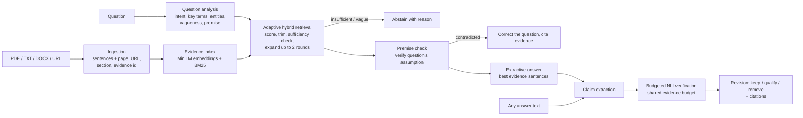

# Claim-Aware Adaptive RAG

A locally runnable retrieval-augmented question-answering system that:

- answers questions **only from your documents and webpages**, citing the exact sentence (and PDF page) behind every statement;
- retrieves evidence **adaptively**, expanding or trimming the evidence set per question and **abstaining** when evidence is insufficient;
- **verifies every claim** against the sources with an NLI model and labels it SUPPORTED, PARTIALLY_SUPPORTED, CONTRADICTED, INSUFFICIENT_EVIDENCE or UNCERTAIN;
- checks the **assumptions inside questions** ("Why did X happen?" when X did not happen);
- **revises any answer text** (e.g. from a chatbot) so that only source-supported statements remain as facts;
- spends verification effort under a **shared evidence budget**, stopping early on settled claims.

> The system measures agreement with the provided sources as judged by a small NLI model. It does **not** establish real-world truth and does **not** eliminate hallucinations; it detects and removes many unsupported statements, with the error rates reported below.

---

## 1. Motivation and problem

Standard RAG pipelines retrieve a fixed top-k set of passages and hand them to a generator. Three problems follow:

1. **Fixed k is wrong for most questions**: too few passages for multi-part questions, too many irrelevant ones for simple lookups, and no signal when the answer is simply absent.
2. **Answers are not checked claim by claim**: a fluent answer can mix supported facts with unsupported or contradicted ones, and a single answer-level score hides which is which.
3. **Verification is expensive**: checking every claim against every passage costs many NLI calls, though most claims are settled by the first one or two passages.

**Research idea:** combine adaptive, question-aware retrieval with claim-level verification under a shared evidence budget, to improve evidence-grounded answering and reduce unsupported claims.

## 2. What the system does (architecture)



| Module | Responsibility |
|---|---|
| [carag/ingestion.py](carag/ingestion.py) | PDF (per-page), TXT/MD, DOCX (incl. tables), webpages (article text, navigation/reference lists removed, PDF URLs supported). Heading detection, hyphenation repair, sentence splitting, de-duplication, clear `IngestionError`s. |
| [carag/index.py](carag/index.py) | Sentence embeddings computed once per source, built-in BM25, evidence-type flags (causal, comparison, numeric, limitation), neighbour links. |
| [carag/query.py](carag/query.py) | Rule-based question analysis: intents, key terms, named entities, vagueness, declarative premise extraction. |
| [carag/retrieval.py](carag/retrieval.py) | Hybrid scoring and adaptive selection (below). |
| [carag/claims.py](carag/claims.py) | Conservative claim extraction; causal decomposition ("A because B"). |
| [carag/verification.py](carag/verification.py) | NLI-based claim labelling rules. |
| [carag/budget.py](carag/budget.py) | Shared evidence budget with evidence-gain-aware scheduling. |
| [carag/answering.py](carag/answering.py) | Grounded extractive answering, premise checks, abstention, citations. |
| [carag/revision.py](carag/revision.py) | Hallucination prevention: rewrites answer text from claim verdicts. |
| [carag/pipeline.py](carag/pipeline.py) | `ClaimAwareRAG` facade used by the CLI, UI and evaluation. |
| [carag/config.py](carag/config.py) | All thresholds in one place. |
| [app.py](app.py) | Streamlit UI. |
| [evaluation/](evaluation/) | Metrics, datasets and evaluation scripts. |
| [evidence_allocator.py](evidence_allocator.py) | The original prototype CLI, kept unchanged for reference. |

## 3. Models

| Model | Role | Why |
|---|---|---|
| `sentence-transformers/all-MiniLM-L6-v2` (~90 MB) | Sentence embeddings for retrieval and evidence relevance | Existing project model; fast on CPU and GPU. |
| `cross-encoder/nli-deberta-v3-small` (~550 MB) | Entailment / contradiction / neutral probabilities for claim verification | Existing project model; small enough for a 4–6 GB GPU. The full probability distribution is used, not just the top label. |

No generative LLM is used. Answers are **extractive**: they consist of source sentences, so every answer sentence has a real citation. I tested a cross-encoder reranker (`ms-marco-MiniLM-L-6-v2`) and did not add it, because it did not fix the observed ranking failures on the test document (see Limitations).

**Measured resource use** (RTX 3050 Laptop 4 GB, Windows 11, Python 3.14): peak GPU memory 722 MiB, peak process RAM ~2.1 GB, ~0.2 s per question on GPU, ~0.7 s on CPU (after model load). Models load lazily once per process and are shared across UI sessions. GPU is used automatically when available; CPU fallback is automatic, including on GPU out-of-memory.

## 4. Installation

Requires Python 3.10+ (developed and tested on **Python 3.14.3**; the brief mentioned 3.12, which was not installed on the development machine).

```bash
cd claim-aware-adaptive-rag
python -m venv .venv
source .venv/Scripts/activate        # Git Bash on Windows;  .venv\Scripts\activate in cmd/PowerShell

# PyTorch first: CUDA 12.6 build (NVIDIA GPU) ...
pip install torch --index-url https://download.pytorch.org/whl/cu126
# ... or CPU-only:  pip install torch --index-url https://download.pytorch.org/whl/cpu

pip install -r requirements.txt
```

The two models (~650 MB) download from Hugging Face on first use; after that, document processing works offline. Webpage ingestion and the SciFact download need internet.

## 5. Usage

### Web interface

```bash
streamlit run app.py
```

1. Upload PDF/TXT/DOCX files and/or enter a URL, then click **Add**. The table shows each source and its sentence count.
2. **Ask** tab: type a question. You get the answer with numbered citations, plus three tabs: **Claim checks** (label + evidence for each claim and for the question's assumption), **Retrieved evidence** (scores), and **How retrieval worked** (expansion/trimming trace, evidence budget use).
3. **Verify text** tab: paste any answer, for example from a chatbot. You get a **revised answer** with only supported facts, corrections for contradicted claims, and per-claim verdicts with the budget used.
4. The sidebar adjusts retrieval, verification, budget and answering thresholds. The defaults work without tuning.

### Command line

```bash
# Answer questions (omit -q for an interactive loop)
python -m carag ask claim_aware_rag_test_document.pdf -q "Why did Trial Two consume more energy than Trial One?" --show-evidence

# Several sources, including a webpage
python -m carag ask report.pdf https://en.wikipedia.org/wiki/Mars -q "How many moons does Mars have?"

# Hallucination detection + prevention for any text (shared budget; --budget N or --no-budget)
python -m carag verify claim_aware_rag_test_document.pdf --text "Trial One sampled at 10 Hz. The study was funded by NASA."

# Baselines: --fixed-k (fixed top-k semantic retrieval), --no-verify; --json for machine-readable output
```

Example (real output, abridged):

```
QUESTION: Why did Trial One consume more energy than Trial Two?
ANSWER  The question's assumption is not supported by the sources. The sources state: Trial Two therefore
        consumed about 2.8 times as much energy as Trial One. [1]

$ python -m carag verify ... --text "Trial One sampled the sensors at 10 Hz. Trial Two consumed an average of
  118 milliwatt-hours per day. The study was funded by NASA."
REVISED ANSWER  Correction: the claim "Trial One sampled the sensors at 10 Hz." conflicts with the sources, which
  state: Trial One sampled the sensors at a frequency of 1 Hz. [1] Trial Two consumed an average of 118
  milliwatt-hours per day. [2] Removed because the sources do not support them: "The study was funded by NASA.".
EVIDENCE BUDGET  used 12/12 NLI checks
```

The original prototype still runs: `python evidence_allocator.py sample_space_facts.pdf`.

## 6. How it works

### Adaptive retrieval ([carag/retrieval.py](carag/retrieval.py))

Every sentence gets `score = 0.65 · cosine + 0.35 · BM25_normalized + intent_bonus`. The intent bonus (≤ 0.08) rewards causal, comparison, numeric or limitation evidence when the question asks for it, **scaled by the fraction of the question's key terms the sentence contains**. A sentence containing "because" but none of the question's terms gets no bonus.

1. **Initial selection and trimming:** keep up to 4 sentences scoring ≥ 70% of the best score. Weaker tail evidence is dropped ("refined").
2. **Sufficiency check:** the evidence is sufficient only if all of these hold:
   - the best score is ≥ 0.45 (0.35 when every key term is found);
   - ≥ 60% of the question's key terms are covered (section headings count);
   - every named entity in the question (e.g. "Trial Three", "Node B") appears in the evidence;
   - causal or numeric questions have causal or numeric evidence about their subject.
3. **Expansion** (up to 2 rounds) if insufficient:
   - search for the missing key terms;
   - add neighbouring sentences of the top hits (explanations often sit in the next sentence);
   - widen k and relax the cutoff.
4. Near-duplicate sentences (cosine ≥ 0.92) are suppressed.
5. If the evidence is still insufficient, or the question is too vague ("Why did it happen?"), the system **abstains** and says why.

### Claim verification ([carag/verification.py](carag/verification.py))

For each claim, the verifier gathers candidates: the most relevant sentences from the whole index, plus two-sentence windows (for evidence split across sentences). It scores each as *premise = evidence, hypothesis = claim* with the NLI model. The labels:

| Label | Definition |
|---|---|
| **SUPPORTED** | A relevant passage (cosine ≥ 0.40) entails the claim with P ≥ 0.70, every number in the claim appears in that passage, and no comparably strong passage contradicts it. |
| **CONTRADICTED** | A closely relevant single sentence (cosine ≥ 0.55) contradicts the claim with P ≥ 0.70 and no comparably strong passage supports it; or one component of a causal claim is contradicted. |
| **PARTIALLY_SUPPORTED** | The full claim is not entailed, but a component is. For example, the effect in "A because B" is supported but the causal link is not. |
| **UNCERTAIN** | Support and contradiction of comparable strength (relevance × probability within 0.10: the sources conflict); or entailment without matching numbers; or inconclusive NLI (0.40–0.70); or not reached within the evidence budget. |
| **INSUFFICIENT_EVIDENCE** | No relevant passage entails or contradicts the claim. |

Design choices that follow the brief:

- **Similarity is never treated as support.** Support always requires NLI entailment.
- **Missing evidence is never labelled CONTRADICTED.** Contradiction requires a closely relevant sentence that the NLI model judges contradictory.
- **Windows are restricted.** A two-sentence window may contradict only when it is more relevant than every single sentence. This rule was added because the small NLI model produced spurious contradictions on multi-entity windows.

### Hallucination prevention ([carag/answering.py](carag/answering.py), [carag/revision.py](carag/revision.py))

These are separate mechanisms:

- **Evidence-grounded generation:** answers are composed only of retrieved source sentences, each with a citation (source, PDF page or URL, evidence id).
- **Abstention:** "I could not find sufficient evidence in the provided sources to answer this question reliably." is returned when retrieval is insufficient, the question is vague, a named entity is missing, or no answer claim survives verification.
- **Premise checking:** for "why" and yes/no questions, the question is turned into a statement ("Why did Trial One consume more…?" → "Trial One consumed more…") and verified. A contradicted premise produces a cited correction instead of an answer.
- **Claim-level detection:** answer claims are verified. Claims that are contradicted or unsupported are removed; partial or uncertain ones are marked.
- **Revision of external text:** `check_answer` / the Verify tab rewrites any draft answer:
  - supported claims are kept and cited;
  - contradicted claims are replaced with a cited correction;
  - for partially supported claims, only the established part is kept;
  - uncertain claims are marked `[Unverified]`;
  - unsupported claims are removed and listed.

**What this cannot establish:** whether a source is itself correct; facts absent from the sources; correctness beyond the NLI model's accuracy (see §7). Because answers are extractive, an answer can be well supported but still **not answer the question** (a relevance failure the verifier cannot detect).

### Budget-aware verification ([carag/budget.py](carag/budget.py))

This restores and completes the scheduling idea from the original prototype. The claims of one answer share a budget of NLI evidence checks (default 4 × number of claims):

- **Base priority:** `0.7 · evidence_gap + 0.3 · hedging_uncertainty`, where `evidence_gap = 1 − similarity of the best candidate passage`.
- **First pass:** every claim receives one step of 2 checks.
- **Scheduling:** the next claim is the one maximizing `priority / (1 + 0.8·attempts) / (1 + 0.75·low_gain_streak)`. Evidence gain is the increase in the best entailment or contradiction probability; steps gaining < 0.05 extend the low-gain streak.
- **Early stopping:** a claim stops consuming budget once it is SUPPORTED or CONTRADICTED.
- **Reserve:** a small part of the budget is reserved for the components of causal claims.
- **Budget ran out:** claims never reached are reported as UNCERTAIN ("not verified"), never as supported.

## 7. Evaluation

All numbers below come from actually running the scripts in [evaluation/](evaluation/). Raw outputs are in [evaluation/results/](evaluation/results/). Reproduce with:

```bash
python -m evaluation.run_synthetic   # synthetic document (~1 min)
python -m evaluation.run_scifact     # SciFact dev, downloads ~3 MB (~2 min on GPU)
python -m evaluation.run_budget      # budget sweep, synthetic + SciFact (~3 min on GPU)
```

**Metric definitions:**

- **Retrieval:** Precision@k, Recall@k, MRR and nDCG@k with binary relevance; for variable-size adaptive sets, set precision/recall and mean k.
- **Verification:** accuracy, per-class precision/recall/F1, macro-F1 and confusion matrices. Labels are collapsed to 3 classes (SUPPORTED / CONTRADICTED / NOT_ESTABLISHED = insufficient + partial + uncertain) to compare with baselines that cannot output the finer labels.
- **Answering:**
  - *answerable accuracy*: the answer contains the gold fact;
  - *correct abstention rate*: abstaining on unanswerable questions;
  - *false-answer rate*: answering an unanswerable question;
  - *premise accuracy*: misleading questions corrected, yes/no correct;
  - *supported-claim rate*: the share of answer claims the verifier labels SUPPORTED;
  - *citation validity*: every citation points to an existing evidence sentence with identical text.
- **Cost:** NLI checks per claim, latency.

### 7.1 Datasets

- **Synthetic (development set):** [claim_aware_rag_test_document.pdf](claim_aware_rag_test_document.pdf), a 3-page **synthetic** sensor-study report generated by [scripts/make_test_document.py](scripts/make_test_document.py). There are 27 questions ([synthetic_qa.json](evaluation/datasets/synthetic_qa.json)): direct, causal, comparison, numeric, limitation, absent, misleading and vague. There are also 30 labelled claims ([synthetic_claims.json](evaluation/datasets/synthetic_claims.json)). All labels come from a single annotator (the project author). **The rules and thresholds were adjusted while inspecting failures on this set, so synthetic results overstate expected performance.** The brief's `claim_aware_rag_test_document.pdf` did not exist in the repository, so this document was created.
- **SciFact dev (held out, real):** 300 expert-written scientific claims, 5,183 abstracts, gold SUPPORT/CONTRADICT/no-evidence labels ([Wadden et al., 2020](https://aclanthology.org/2020.emnlp-main.609/)). No tuning was done on SciFact.

### 7.2 Retrieval

| System | P@1 | R@3 | R@10 | MRR | nDCG@10 | set P | mean k |
|---|---|---|---|---|---|---|---|
| **SciFact** BM25 top-10 | 0.649 | 0.812 | 0.914 | 0.744 | 0.784 | 0.099 | 10 |
| SciFact semantic (MiniLM) top-10 | 0.617 | 0.804 | 0.912 | 0.727 | 0.771 | 0.100 | 10 |
| SciFact **hybrid** top-10 | 0.697 | **0.871** | **0.952** | **0.800** | **0.835** | 0.104 | 10 |
| SciFact **adaptive hybrid** | **0.702** | 0.865 | 0.906 | 0.797 | 0.818 | **0.300** | 4.2 |

Synthetic (20 labelled questions, k = 5):

| System | P@1 | R@5 | MRR | nDCG@5 | set P | mean k |
|---|---|---|---|---|---|---|
| semantic top-5 | 0.85 | 0.87 | 0.89 | 0.85 | 0.23 | 5 |
| hybrid top-5 | 0.90 | 0.91 | 0.91 | 0.90 | 0.25 | 5 |
| adaptive hybrid | 0.85 | 0.85 | 0.89 | 0.85 | 0.52 | 2.5 |

On SciFact, hybrid scoring beats both BM25 and semantic-only retrieval. Adaptive selection returns about 4 abstracts instead of 10, tripling set precision at the cost of 4.6 points of recall.

### 7.3 Claim verification (3-way)

| System | SciFact acc | SciFact macro-F1 | Synthetic acc | Synthetic macro-F1 |
|---|---|---|---|---|
| Similarity threshold (cosine ≥ 0.5 ⇒ supported; original prototype logic) | 0.537 | 0.384 | 0.467 | 0.363 |
| NLI on top-1 passage, top label ≥ 0.7 (original prototype logic) | 0.517 | 0.492 | 0.800 | 0.806 |
| **Claim-aware verifier** | **0.603** | **0.590** | **0.867** | **0.865** |

SciFact per-class F1 for the claim-aware verifier: SUPPORTED 0.567 (precision 0.91, recall 0.41), CONTRADICTED 0.551, NOT_ESTABLISHED 0.652. It is conservative: when it says SUPPORTED it is usually right, but it misses many supported claims. On the synthetic set the fine-grained 5-way accuracy is 0.833 (macro-F1 0.840).

SciFact setting: oracle abstract. The claim is verified against the sentences of its gold abstract, or, for claims with no evidence, the first cited abstract. The absolute numbers are far below published SciFact systems, which are trained in-domain; this is a small general-domain NLI model applied out of domain.

### 7.4 End-to-end answering (synthetic, 27 questions)

| System | Overall | Answerable acc | Correct abstention | False-answer rate | Premise questions | Citation validity | Latency |
|---|---|---|---|---|---|---|---|
| Fixed top-3 semantic, always answers | 0.593 | 0.938 | 0.143 | 0.857 | 0.00 | 1.00 | 0.01 s |
| Adaptive retrieval + abstention, no verification | 0.815 | 0.938 | 1.000 | 0.000 | 0.00 | 1.00 | 0.01 s |
| **Adaptive + claim verification (full system)** | **0.963** | 0.938 | 1.000 | 0.000 | **1.00** | 1.00 | 0.06 s |

Adaptive retrieval with sufficiency checks removes false answers on absent-information questions (86% → 0% on 7 questions). Claim and premise verification is what handles misleading questions (0/4 → 4/4). The one remaining error is the "battery capacity" vocabulary-mismatch question (see Limitations). These are development-set results (§7.1).

### 7.5 Budget-aware verification (accuracy vs. cost)

Claims are verified in shuffled groups of 5 under a shared budget. SciFact here uses a harder retrieve-then-verify setting: a pooled index of 2,575 sentences from the 283 abstracts cited in the dev set. Cost is the number of NLI checks actually run.

| Strategy | Budget/claim | Synthetic checks/claim | Synthetic acc | SciFact checks/claim | SciFact acc | SciFact macro-F1 |
|---|---|---|---|---|---|---|
| Exhaustive | – | 15.0 | 0.867 | 10.7 | 0.570 | 0.563 |
| Fixed split (no early stop) | 4 | 8.2* | 0.833 | 4.2 | 0.557 | 0.540 |
| Round-robin + early stop | 3 | 2.9 | 0.867 | 3.0 | 0.543 | 0.526 |
| Priority (evidence-gain) | 3 | 2.9 | 0.867 | 3.0 | 0.543 | 0.527 |
| Round-robin + early stop | 6 | 5.8 | 0.900 | 5.6 | 0.563 | 0.553 |
| **Priority (evidence-gain)** | 6 | 5.8 | 0.900 | 5.6 | **0.570** | **0.559** |

\*Fixed split does not cap causal decomposition, so it exceeds its nominal budget. Full sweep (budgets 2/3/4/6) in [budget_results.json](evaluation/results/budget_results.json).

**Findings:**

- A shared budget with early stopping **matches exhaustive accuracy with about 80% fewer NLI checks on the synthetic set** (3 vs 15 per claim) **and about 48% fewer on SciFact** (5.6 vs 10.7).
- **The evidence-gain priority formula is not measurably better than round-robin with the same early stopping.** The two are identical at budgets 3–4, priority is worse at budget 2, and slightly better at budget 6; these differences are within noise at this sample size. The savings come from sharing the budget and stopping early, not from the priority ordering.

## 8. Testing

```bash
python -m pytest          # 61 tests, ~50 s on GPU (model-backed tests load the models once)
```

The tests cover:

- **Ingestion:** PDF, TXT, DOCX, and webpages (including live HTTP against a local server); invalid URLs; empty, unsupported and corrupt files; page/section metadata.
- **Retrieval:** direct, causal-with-distractors, numeric, absent-information expansion, trimming, deduplication.
- **Verification:** supported, contradicted, insufficient and partial claims; "missing ≠ contradicted".
- **Answering:** citation correctness, abstention, misleading premises, yes/no questions, baseline modes.
- **Budget and revision:** budget never exceeded; same labels as exhaustive; early stopping; tiny budgets; revision behaviour.
- **UI:** the Streamlit app is driven headlessly via `streamlit.testing`.

## 9. Known limitations

- **Relevance failures are not caught by verification.** "What battery capacity did the sensor nodes have?" retrieves "…a battery-powered environmental sensor node" instead of "…the same 3000 mAh lithium battery…" (the word "capacity" never appears). The answer is well supported by the source but does not answer the question.
- **NLI model errors:**
  - spurious contradictions on unrelated but topical sentences (e.g. "The gateway was located two kilometres from the rooftop" → CONTRADICTED);
  - weak numeric and comparative reasoning ("25 days vs 71 days");
  - low recall of SUPPORTED on scientific text (0.41 on SciFact).
- **Heuristics are hand-written:** question analysis, premise extraction, entity detection and claim splitting are rule-based. They are transparent but brittle for unusual phrasing, and the premise extraction handles only "why/did/does/is…" forms.
- **Thresholds were set on a small synthetic set written by the same author.** SciFact is the only held-out evaluation, and there is no held-out end-to-end QA benchmark.
- **Extractive answers only:** no synthesis across sentences and no paraphrase. The optional use of a local generative LLM was not implemented.
- **Ingestion gaps:** no OCR for scanned PDFs; tables in PDFs are extracted as plain text; JavaScript-rendered webpages are not supported.
- **Budget scheduling:** the priority formula showed no measurable gain over round-robin (§7.5).

## 10. Future work

- Evaluate end-to-end QA on a labelled, real benchmark (e.g. QASPER, or HotpotQA with supporting facts) with a held-out test split.
- Try a stronger or domain-adapted NLI verifier (e.g. DeBERTa-v3-base/large MNLI-FEVER-ANLI, or models trained on SciFact) within the 4–6 GB VRAM limit.
- Add an answer-relevance check (e.g. a QA cross-encoder) to catch supported-but-irrelevant answers.
- Add an optional local generator (e.g. a 0.5–1.5B instruct model) whose drafts pass through `check_answer`, and measure hallucination rates before and after revision.
- Investigate when priority scheduling helps: larger claim groups, tighter budgets, a learned stopping rule.
- Calibrate the thresholds on held-out data.

## 11. Project layout

```
carag/                 core package (see §2)
app.py                 Streamlit UI
evidence_allocator.py  original prototype CLI (unchanged)
evaluation/            metrics.py, run_synthetic.py, run_scifact.py, run_budget.py, datasets/, results/
scripts/               make_test_document.py (generates the synthetic test PDF)
tests/                 pytest suite
claim_aware_rag_test_document.pdf   synthetic test document
sample_space_facts.pdf              second small test document
```

## License

MIT. See [LICENSE](LICENSE).
