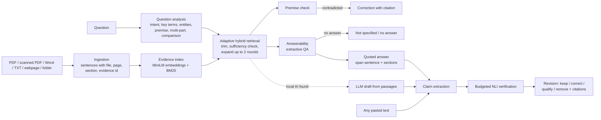

# Claim-Aware Adaptive RAG

Ask questions about your own documents and get answers you can check. Claim-Aware Adaptive RAG is a retrieval-augmented question-answering system and Windows desktop application that runs entirely on your computer:

- **Answers only from your documents and webpages,** citing the exact sentence, file, section and page behind every statement.
- **Retrieves adaptively:** it decides per question how much evidence to use, trims weak results and expands the search when evidence is missing.
- **Verifies every claim** against the sources with an NLI model, and says so when a question's assumption is wrong, when documents disagree, when a detail is not specified, or when the answer is not there.
- **Uses any local AI model it finds** (Ollama, LM Studio, Jan, GPT4All, llama.cpp and others) to write fluent answers, then checks every sentence of them. Without a model it answers directly from the documents.
- **Spends verification effort under a budget,** stopping early on claims that are already settled.

> The system measures agreement with the provided sources, as judged by NLI and QA models. It does **not** establish real-world truth, and it reduces but does not eliminate unsupported statements; measured error rates are in [§8](#8-evaluation).

**Contents:** [1. Install](#1-install-and-run) · [2. Using the app](#2-using-the-application) · [3. Local AI models](#3-local-ai-models) · [4. Local and website modes](#4-local-and-website-modes) · [5. How it works](#5-how-it-works) · [6. Models](#6-models) · [7. Command line and API](#7-command-line-and-python-api) · [8. Evaluation](#8-evaluation) · [9. Testing](#9-testing) · [10. Building a release](#10-building-a-release) · [11. Limitations](#11-known-limitations) · [12. Future work](#12-future-work) · [13. Project layout](#13-project-layout)

---

## 1. Install and run

### Windows installer (recommended)

1. **Download [ClaimAwareRAG-Setup.exe](https://github.com/manishreddy1767/claim-aware-adaptive-rag/raw/main/release/ClaimAwareRAG-Setup.exe)** (2 MB) and open it.
2. If Windows shows *"Windows protected your PC"*, choose **More info → Run anyway**. The installer is not code-signed, so Windows does not recognise it yet.
3. Follow the wizard. Optional tasks: a desktop icon, and **Install a local AI model** (Ollama and qwen3:8b, about 5 GB more). You can skip the AI task: the app finds AI programs you install later by itself.
4. Setup downloads Python (if missing), PyTorch for your graphics card (CUDA build with an NVIDIA GPU, otherwise CPU) and the language models. This takes 10–30 minutes, once, and needs an internet connection; a progress window stays open until it finishes.
5. Open **Claim-Aware RAG** from the Start menu or the desktop. It opens in its own window; the first start can take a minute.

No administrator rights are needed: it installs per user into `%LOCALAPPDATA%\Programs\ClaimAwareRAG` and appears in **Settings → Apps**. To update, run a newer Setup over the old one; accounts and documents are kept. Uninstalling asks whether to also delete your accounts and documents; Ollama and its models are separate apps and stay installed.

**Requirements:** Windows 10 or 11 (64-bit); 8 GB RAM (16 GB recommended); about 6 GB of disk with an NVIDIA GPU (PyTorch with CUDA is 4 GB, the models 0.9 GB; keep 8 GB free while installing), about 2.5 GB without; internet only during installation. Each laptop runs its own independent copy; no other computer needs to be on.

### Windows zip (manual)

Unzip `ClaimAwareRAG-windows.zip` (see [§10](#10-building-a-release)) and double-click **`install.bat`**. It does the same as Setup: Python via `winget` if missing, `.venv`, PyTorch, the app, the models and a desktop shortcut. Options: `--no-shortcut`, `--no-pause`, `--ai qwen3:8b` (also install Ollama and the model). Start it with **`start.bat`** (opens in the browser) and remove it with **`uninstall.bat`** (`--keep-data` / `--delete-data`).

### From source (any platform)

```bash
python -m venv .venv && source .venv/bin/activate      # Windows: .venv\Scripts\activate
pip install torch --index-url https://download.pytorch.org/whl/cu126   # or .../whl/cpu
pip install -e ".[ocr]"                                 # add ,dev for the tests
carag-desktop          # the app in its own window
carag-app              # or: in the browser at http://localhost:8765
```

`carag-app` options: `--mode local|web`, `--port 9000` (the next free port is used if it is busy), `--data-dir PATH`, `--no-browser`, `--no-signup` (only the first account can be created), `--host` (default `127.0.0.1`: this computer only). The `CARAG_DATA_DIR` environment variable also sets the data folder.

### Where your data is

Everything is in `%LOCALAPPDATA%\ClaimAwareRAG` (Windows; `~/Library/Application Support/ClaimAwareRAG` on macOS, `~/.local/share/claim-aware-rag` on Linux):

| Path | Contents |
|---|---|
| `carag.db` | SQLite database: `users` (scrypt password hashes), `sessions` (SHA-256 hashes of session tokens), `documents`, `history` |
| `files/<user id>/` | Uploaded files and saved webpages, under random names. Files added from a folder are read where they are and not copied. |
| `settings.json` | AI settings |
| `logs/app.log`, `logs/server.log` | The window and the engine logs |

### If it does not open

- **The window shows "could not start":** send `logs\server.log` (its path is shown on that screen).
- **It opened in a web browser instead of its own window:** Microsoft Edge WebView2 could not start; the app still works in the browser. Updating Windows usually installs WebView2.
- **It froze ("Not Responding"):** version 0.3.0 could deadlock while loading the models; install the current Setup over it.
- **It does not open after a crash, or after opening it twice quickly:** open Task Manager, end any *Claim-Aware RAG* or *pythonw* tasks, and open it again.

## 2. Using the application

1. **Create an account** on the first screen, or sign in. Each account sees only its own documents and history.
2. **Add documents:** drag in PDF (including scanned pages, read with OCR), Word, text or Markdown files up to 25 MB; type a **file or folder path** under *Add from this computer* (folders are read with their subfolders); or paste a **webpage** address.
3. **Ask a question.** With a local AI model available, choose *AI answer* or *Quoted* next to the Ask button; otherwise answers are quoted from the documents. Every answer has numbered citations; click a number to see the source sentence, file, section and page. *How this answer was checked* lists the verdict for every claim, and for AI answers the model's original text and what was removed.
4. **History** keeps your questions. **Check a text** verifies any pasted text, for example a chatbot answer, statement by statement against your documents.

Every answer is labelled with what kind of answer it is:

| Label | Example |
|---|---|
| Answered from your documents | "Full-time employees receive 24 days of paid leave per calendar year. [1]" |
| Confirmed by your documents | A yes/no question whose statement the documents support |
| The question's assumption is wrong | "Does the company guarantee 30 days…?" → "No. … 24 days … prorated …" |
| Not specified in your documents | "Maternity leave in weeks?" → the documents mention it but give no duration |
| Your documents disagree | Travel policy ₹2,500 vs travel FAQ ₹3,000, both cited |
| No answer in your documents | Nothing relevant; nothing is made up |

The Streamlit research console (`streamlit run app.py`) exposes every threshold for experiments.

## 3. Local AI models

The app looks for local AI servers on this computer at their usual addresses and uses one without any setup:

| Program | Address probed |
|---|---|
| Ollama | `127.0.0.1:11434` (or `OLLAMA_HOST`) |
| LM Studio | `127.0.0.1:1234` (switch on its local server) |
| Jan | `127.0.0.1:1337` |
| GPT4All | `127.0.0.1:4891` |
| llama.cpp server / LocalAI | `127.0.0.1:8080` |
| vLLM | `127.0.0.1:8000` |
| KoboldCpp | `127.0.0.1:5001` |
| text-generation-webui | `127.0.0.1:5000` |
| Any other OpenAI-compatible server | the address entered in **AI settings → Other AI server** |

All are probed at once with a short timeout, and the result is cached for 20 seconds. Embedding models are skipped; the best-known chat model is chosen (Qwen 3 first, then Qwen 2.5, Llama 3.x, Gemma, Mistral, Phi…), or the model you pick in **AI settings**.

**How an AI answer is made:** the same gates as quoted answers run first (no sources, a vague question, a named subject that no document mentions), so the model is never asked to answer from nothing. The model receives the retrieved passages, both sides of a comparison and the sections around the best hits, and is told to use only them. Its draft is then verified claim by claim: supported sentences are kept with citations, unsupported ones removed, contradicted ones corrected, and disagreeing sources shown side by side. A trailing "the documents do not contain this information" after a real answer is dropped.

**It never fails because of the model:** with no model, AI turned off, *Quoted* chosen, or any model error (not running, missing model, out of memory), the question is answered directly from the documents, with a note saying why.

On a 4 GB RTX 3050 laptop GPU, qwen3:8b runs partly on the processor: about 5–20 s per answer, about 40 s for the first while it loads.

## 4. Local and website modes

| | Local application (default) | Website (`carag-app --mode web --host 0.0.0.0`) |
|---|---|---|
| Accounts | stored | stored (needed to sign in) |
| Documents | saved on this computer; kept after sign-out and restarts | **in memory only**, never written to disk; deleted at sign-out, after 2 hours idle, or when the server stops |
| Question history | saved | in memory, deleted at sign-out |
| Files and folders on this computer | yes, read in place; only from the computer the app runs on | no |
| Webpages | yes | public websites only: private-network and loopback addresses are refused, including after redirects |
| AI settings | editable | read-only for visitors |

In website mode each sign-in has its own workspace, even for the same account on two devices. Run it behind HTTPS (for example Caddy or nginx) if it is reachable from the internet; on its own it serves plain HTTP. All visitors share one GPU, so it suits a small group.

**Security:** passwords are hashed with scrypt and a random salt; sessions are random tokens in HttpOnly, SameSite=Strict cookies, and only their hashes are stored; five failed sign-ins lock an account for a minute, with the same message for unknown users; users cannot see or delete each other's documents; uploads are stored under server-generated names, so file names cannot escape the data folder; cross-site state-changing requests are rejected; a strict Content-Security-Policy is set, and all document text is inserted into the page as text, never as HTML.

## 5. How it works


```mermaid
flowchart LR
  A[PDF / scanned PDF / Word / TXT / webpage / folder] --> B[Ingestion<br/>sentences with file, page,<br/>section, evidence id]
  B --> C[Evidence index<br/>MiniLM embeddings + BM25]
  Q[Question] --> QA[Question analysis<br/>intent, key terms, entities,<br/>premise, multi-part, comparison]
  QA --> R[Adaptive hybrid retrieval<br/>trim, sufficiency check,<br/>expand up to 2 rounds]
  C --> R
  R --> P[Premise check]
  P -->|contradicted| Y[Correction with citation]
  R --> S[Answerability<br/>extractive QA]
  S -->|no answer| X[Not specified / no answer]
  S --> G[Quoted answer<br/>span sentence + sections]
  R -.->|local AI found| L[LLM draft from passages]
  G --> K[Claim extraction]
  L --> K
  T[Any pasted text] --> K
  K --> V[Budgeted NLI verification]
  V --> H[Revision: keep / correct /<br/>qualify / remove + citations]
```

| Module | Responsibility |
|---|---|
| [carag/ingestion.py](carag/ingestion.py) | PDF per page with OCR fallback for scanned pages, TXT/MD, DOCX (with tables), webpages (headless-browser fallback for JavaScript pages; per-redirect URL guard). Headings, hyphenation repair, sentence splitting, de-duplication. |
| [carag/index.py](carag/index.py) | Sentence embeddings, BM25, evidence-type flags (causal, comparison, numeric, limitation), neighbour links. |
| [carag/query.py](carag/query.py) | Rule-based question analysis: intents, key terms (question-framing words removed), entities, vagueness, premise extraction, multi-part and comparison detection. |
| [carag/retrieval.py](carag/retrieval.py) | Hybrid scoring and adaptive selection. |
| [carag/relevance.py](carag/relevance.py) | Extractive QA: answer span and answerability. |
| [carag/answering.py](carag/answering.py) | Quoted answers: premise checks, answerability, multi-part completion, side-by-side comparisons, abstention, citations, answer type. |
| [carag/claims.py](carag/claims.py) | Conservative claim extraction; causal decomposition ("A because B"). |
| [carag/verification.py](carag/verification.py) | NLI claim labelling rules. |
| [carag/budget.py](carag/budget.py) | Shared evidence budget, with retrieval rounds charged and per-part shares. |
| [carag/revision.py](carag/revision.py) | Rewrites any answer text from claim verdicts. |
| [carag/llm.py](carag/llm.py) | Local LLM discovery (Ollama and OpenAI-compatible servers), model choice, drafting. |
| [carag/pipeline.py](carag/pipeline.py) | `ClaimAwareRAG` facade, including `ask_with_llm`. |
| [carag/config.py](carag/config.py) | All thresholds in one place. |
| [carag/server/](carag/server/) | The application: Starlette server (`app.py`), accounts (`auth.py`), SQLite store (`store.py`), per-user workspaces in both modes (`workspace.py`), launcher (`launcher.py`), desktop window (`desktop.py`), model download (`prefetch.py`), frontend (`static/`). |

### Ingestion

Every sentence becomes an evidence unit with its source, page (PDFs), section heading and an id such as `report.pdf#p2.s15`. Exact duplicates and fragments under 3 words are dropped and counted. Scanned pages are read with RapidOCR (with a warning); webpages that yield fewer than 3 sentences from static HTML are rendered in headless Chromium (not in website mode).

### Adaptive retrieval

Every sentence gets `score = 0.65 · cosine + 0.35 · BM25_normalized + intent_bonus`, where the intent bonus (≤ 0.08) rewards causal, comparison, numeric or limitation evidence, scaled by the share of the question's key terms the sentence contains.

1. **Select and trim:** up to 4 sentences scoring at least 70% of the best; weaker tail results are dropped.
2. **Sufficiency check:** best score ≥ 0.45 (0.35 when every key term is found); ≥ 60% of key terms covered (section headings count); every named entity present; causal or numeric evidence for causal or numeric questions.
3. **Expand** up to 2 rounds when insufficient: search for the missing key terms, add neighbouring sentences of the top hits, widen k and relax the cutoff. Each round costs evidence budget.
4. Near-duplicates (cosine ≥ 0.92) are suppressed.

### Answering from the documents

- **Gates:** a vague question, or a named subject that appears in no document ("Who is Elizabeth Bennet?"), is refused before anything else.
- **Premise check:** yes/no and "why" questions become a statement ("Can employees carry forward…?" → "Employees can carry forward…"), built from the first sentence only, and verified. A contradicted premise gives "No." (or "the question's assumption is wrong") with the correcting sentence and the rest of its section; evidence that only says something is *not established* gives "The sources do not establish this" instead of "No".
- **Answerability:** an extractive QA model (SQuAD 2.0) finds the answer span. When it finds none but the topic is covered (retrieval sufficient, or best evidence cosine ≥ 0.50), the answer says the documents do not specify the detail and cites the closest passage.
- **Composition:** the sentence holding the span, plus, for multi-part questions (procedures, lists, "including…"), the related sentences of the same document and the rest of short sections, up to 6. Explicit comparisons ("Compare X with Y, including…") are retrieved and answered side by side, under one shared budget; a side the documents do not describe is reported as such.

### Claim verification

Candidate evidence for a claim is the most relevant sentences of the index plus two-sentence windows and a multi-sentence premise; each is scored as *premise = evidence, hypothesis = claim*.

| Label | Definition |
|---|---|
| **SUPPORTED** | A relevant passage (cosine ≥ 0.40) entails the claim with P ≥ 0.70, every number in the claim appears in it, its time quantities agree ("every year" ≠ "every 3 years"), and no comparably strong passage contradicts it. |
| **CONTRADICTED** | A closely relevant sentence (cosine ≥ 0.55) contradicts it with P ≥ 0.70, or entailing evidence states a different time quantity; or a component of a causal claim is contradicted. |
| **NOT_SPECIFIED** | The contradicting evidence only says the subject is not established, specified or covered. |
| **PARTIALLY_SUPPORTED** | A component is entailed but not the whole (e.g. the effect of "A because B" but not the link). |
| **UNCERTAIN** | Support and contradiction of comparable strength (the sources disagree); entailment without matching numbers; inconclusive NLI (0.40–0.70); or not reached within the budget. |
| **INSUFFICIENT_EVIDENCE** | No relevant passage entails or contradicts the claim. |

Similarity is never treated as support, and missing evidence is never labelled contradicted. Claims quoted from the documents are marked when their only support is the very sentence they were copied from.

### Revision (hallucination prevention)

For any answer text (quoted answers, AI drafts, pasted text), revision keeps supported claims with a citation, replaces contradicted claims with a cited correction, states disagreeing sources once with both citations, keeps only the established part of a partial claim, marks other uncertain claims `[Unverified]`, and removes unsupported claims, listing them.

### Budget-aware verification

The claims of an answer share a budget of NLI checks (4 per claim, at least 6). Every claim gets one step of 2 checks, then the claim with the highest `priority / (1 + 0.8·attempts) / (1 + 0.75·low_gain_streak)` goes next, with `priority = 0.7 · evidence gap + 0.3 · hedging`. A claim stops once SUPPORTED, CONTRADICTED or NOT_SPECIFIED; claims never reached are reported as not verified, never as supported. Each adaptive-retrieval round costs 2 checks. `budget.answer_budget` makes the budget a hard total per answer, and each side of a comparison gets an equal share.

## 6. Models

| Model | Size | Role |
|---|---|---|
| `sentence-transformers/all-MiniLM-L6-v2` | 90 MB | Sentence embeddings for retrieval and relevance |
| `cross-encoder/nli-deberta-v3-base` (default) | 740 MB | Claim verification (entailment / contradiction / neutral). Better than `-small` on SciFact and the synthetic set. |
| `cross-encoder/nli-deberta-v3-small` (option) | 550 MB | Lower-memory verifier |
| `deepset/minilm-uncased-squad2` | 130 MB | Answer span and answerability |
| `models/nli-deberta-v3-base-ragtruth` (optional, trained with [scripts/train_verifier.py](scripts/train_verifier.py)) | 740 MB | Verifier fine-tuned on RAGTruth train (§8.7) |
| Any local chat model (optional) | – | Answer drafts, e.g. `qwen3:8b` in Ollama |

No paid APIs or cloud services. The models download once from Hugging Face and are then read from the local cache. Default answering uses about 1 GB of GPU memory, with automatic CPU fallback (also on GPU out-of-memory).

## 7. Command line and Python API

```bash
python -m carag ask report.pdf -q "Why did Trial Two consume more energy than Trial One?" --show-evidence
python -m carag ask report.pdf https://en.wikipedia.org/wiki/Mars -q "How many moons does Mars have?"
python -m carag verify report.pdf --text "Trial One sampled at 10 Hz. The study was funded by NASA."
```

Options: `--fixed-k` (fixed top-k baseline), `--no-verify`, `--no-qa-check`, `--nli-model …`, `--device cpu`, `--json`.

```python
from carag.pipeline import ClaimAwareRAG
from carag.llm import LLMGenerator, OllamaClient

rag = ClaimAwareRAG()
rag.add_source("policy.pdf")
print(rag.ask("How many leave days do full-time employees get?").answer)
print(rag.ask_with_llm("If someone joins in July, how much leave do they get?",
                       LLMGenerator("qwen3:8b", OllamaClient())).text)
print(rag.check_answer("Employees get 30 days of leave.").revised.text)
```

The original prototype still runs: `python evidence_allocator.py sample_space_facts.pdf`.

## 8. Evaluation

Every number below comes from the scripts in [evaluation/](evaluation/) with the default configuration; raw outputs and reports are in [evaluation/results/](evaluation/results/). The date says when each result was produced.

| Script | Measures | Time (GPU) |
|---|---|---|
| `python -m evaluation.run_retrieval` | Adaptive retrieval vs baselines and ablations, 4 datasets | ~5 min |
| `python -m evaluation.run_northstar [--budgets 0,6,8,12,20]` | End-to-end answering on the handbook, per category; answer-budget sweep | ~1 min |
| `python -m evaluation.run_synthetic` | Retrieval, verification, answering on the synthetic document | ~1 min |
| `python -m evaluation.run_scifact` | Claim verification (and retrieval) on SciFact | ~3 min |
| `python -m evaluation.run_squad` | End-to-end answering and abstention on SQuAD 2.0 | ~3 min |
| `python -m evaluation.run_budget` | Verification budget sweep and strategies | ~6 min |
| `python -m evaluation.run_hallucination` | Planted hallucinations at several budgets; real local LLM drafts vs verified answers | ~30 min |
| `python -m evaluation.run_ragtruth` | Hallucination detection on RAGTruth | ~30 min |
| `python -m evaluation.run_generation` | Small Hugging Face LLM drafts vs revised | ~5 min |

### 8.1 Datasets

| Dataset | Type | Used for | Caveat |
|---|---|---|---|
| Northstar handbook ([evaluation/datasets/northstar](evaluation/datasets/northstar/)): 7 documents, 43 questions in 11 categories, including deliberately conflicting sources | Synthetic | Regression, end-to-end behaviour | Documents 01–04 reconstructed from a manual test report; rules were fixed while looking at its failures, so results are optimistic. |
| Synthetic study document ([claim_aware_rag_test_document.pdf](claim_aware_rag_test_document.pdf)): 27 questions, 30 claims | Synthetic, author-labelled | Development | Thresholds were set on it: optimistic. |
| [SQuAD 2.0](https://aclanthology.org/P18-2124/) dev: 35 Wikipedia articles, answerable and unanswerable questions; articles 0–16 dev, 17–34 test | Real | Retrieval, answering, abstention | The QA model was trained on SQuAD 2.0 train: in-distribution. |
| [SciFact](https://aclanthology.org/2020.emnlp-main.609/) dev: 300 claims, 5,183 abstracts | Real | Retrieval, verification | Not tuned on. |
| [RAGTruth](https://aclanthology.org/2024.acl-long.585/) test: 900 LLM responses (300 per task) with human hallucination spans | Real LLM outputs | Hallucination detection | Design decisions on the train split only. |

### 8.2 Adaptive retrieval (2026-10-09; [report](evaluation/results/retrieval_report.md))

1,000 questions. Recall/precision/F1 are set metrics against the gold evidence sentences (abstracts for SciFact).

| Dataset | Adaptive recall / precision / F1 | Results | Fixed hybrid top-5 recall / F1 | F1 gain (p) | Hybrid with the same count, F1 |
|---|---|---|---|---|---|
| Northstar (43) | 0.80 / 0.54 / 0.60 | 3.1 | 0.86 / 0.42 | +0.18 (<0.001) | 0.64 |
| Synthetic (27) | 0.85 / 0.50 / 0.60 | 2.7 | 0.91 / 0.38 | +0.22 (<0.001) | 0.61 |
| SQuAD 2.0 (630) | 0.94 / 0.37 / 0.50 | 3.8 | 0.94 / 0.32 | +0.19 (<0.001) | 0.50 |
| SciFact (300) | 0.91 / 0.30 / 0.43 | 4.2 | 0.92 / 0.32 | +0.11 (<0.001) | 0.43 |

- **Adaptive retrieval gives much higher precision at the same recall** on SQuAD and SciFact (recall difference ≤ 0.02, not significant), and costs about 0.06 recall on the two small sets.
- **The gain comes from choosing how many results to return, not from better ranking:** plain hybrid ranking with the same number of results is as good (differences ≤ 0.05, p ≥ 0.09).
- **Expansion adds little:** recall +0.005 to +0.017; it improves 3–50% of the questions it expands and lowers their precision by 0.13–0.19.
- **Ablations:** tail trimming carries the precision gain (F1 −0.08 to −0.13 without it); hybrid scoring beats semantic-only and BM25-only everywhere; neighbour sentences, the missing-term search and the intent bonus make no measurable difference on these sets.
- **The sufficiency check** is accurate on the small sets (0.88, 0.96) but on SQuAD and SciFact it calls about 73% of unanswerable questions sufficient (accuracy 0.65, 0.64). The QA and verification steps catch these later; retrieval alone does not.

### 8.3 End-to-end answering on the Northstar handbook (2026-10-09)

**41 of 43 questions** handled as expected, mean fact recall **0.97**. Every category is fully correct (factual 10/10, procedure, multi-fact, comparison, false premise 6/6, yes/no, conflicting sources, not specified 5/5, absent topics, vague) except **multi-hop, 1/3**: "What approval does a 12-day leave need?" and "If someone joins in July…" need reasoning the quoted mode cannot do (AI answers can; §3). 95% of supported quoted claims are backed only by the sentence they quote.

Answer-budget sweep (total checks per answer): automatic 7.1 checks, 41/43, fact recall 0.973; budget 8: 5.1 checks, same results; budget 6: 4.4 checks, 41/43, fact recall 0.968. These questions are easy for the verifier, so a tight budget costs little here.

### 8.4 Claim verification (2026-10-05)

| System | SciFact acc | SciFact macro-F1 (3-way) | SciFact binary acc / F1 | Synthetic acc | Synthetic macro-F1 |
|---|---|---|---|---|---|
| Similarity threshold (cosine ≥ 0.5 ⇒ supported) | 0.537 | 0.384 | 0.547 / 0.516 | 0.467 | 0.363 |
| NLI on the top-1 passage | 0.560 | 0.539 | 0.720 / 0.653 | 0.900 | 0.903 |
| **Claim-aware verifier (default)** | **0.670** | **0.659** | **0.777 / 0.740** | **0.967** | **0.966** |

SciFact in the oracle-abstract setting (each claim against its cited abstract's sentences). Absolute numbers are below SciFact systems trained in-domain.

### 8.5 End-to-end answering on SQuAD 2.0 and the synthetic set

SQuAD 2.0 test split (108 answerable + 108 unanswerable questions from 18 articles; 2026-09-26, before the later answering changes in §5):

| System | Overall | Answer accuracy | Over-abstention | False-answer rate |
|---|---|---|---|---|
| Fixed top-3, always answers | 0.440 | 0.880 | 0.000 | 1.000 |
| Adaptive retrieval + sufficiency abstention | 0.551 | 0.759 | 0.176 | 0.657 |
| + claim and premise verification | 0.556 | 0.759 | 0.176 | 0.648 |
| **+ QA answerability (default)** | **0.819** | **0.852** | **0.139** | **0.213** |

Retrieval heuristics alone refuse only a third of SQuAD's adversarial unanswerable questions; claim verification adds little to quoted answers, which are supported by the sentence they quote; the QA answerability check is what cuts false answers from 65% to 21% (partly in-distribution).

Synthetic set (27 questions, 2026-10-05): fixed top-3 always answers (overall 0.593, false answers 0.857); adaptive retrieval with abstention 0.815 (false answers 0); with claim and premise verification **0.963** (premise questions 4/4); with the QA answerability check 0.926 (one extra abstention on this out-of-distribution document). Citation validity is 1.00 for every system.

### 8.6 Budget-aware verification (2026-10-09)

Claims verified in shuffled groups of 5 under a shared budget; cost is the number of NLI checks actually run.

| Strategy | Budget/claim | Synthetic checks/claim | Synthetic acc | SciFact checks/claim | SciFact acc | SciFact macro-F1 |
|---|---|---|---|---|---|---|
| Exhaustive | – | 15.6 | 0.967 | 11.7 | 0.647 | 0.639 |
| Fixed split (no early stop) | 4 | 7.3 | 0.967 | 4.3 | 0.620 | 0.609 |
| Round-robin + early stop | 3 | 2.7 | 0.967 | 3.0 | 0.607 | 0.596 |
| Priority (evidence gain) | 3 | 2.7 | 0.967 | 3.0 | 0.597 | 0.584 |
| Round-robin + early stop | 6 | 5.2 | 0.967 | 5.7 | 0.633 | 0.624 |
| Priority (evidence gain) | 6 | 5.2 | 0.967 | 5.7 | 0.630 | 0.620 |

- **A shared budget with early stopping matches exhaustive accuracy with 83% fewer checks on the synthetic set** (2.7 vs 15.6 per claim) and stays within 0.014 of it **with 52% fewer on SciFact** (5.7 vs 11.7).
- **The evidence-gain priority is not better than round-robin** with the same early stopping (equal or up to 0.02 lower): the savings come from sharing the budget and stopping early. At 2 checks per claim the synthetic accuracy drops to 0.80–0.87.

### 8.7 Hallucination detection on real LLM answers (RAGTruth test, 2026-09-27)

900 responses by GPT-3.5/4, Llama-2 and Mistral, with human-annotated hallucinated spans; a sentence is flagged if any of its claims is not supported by that response's own source.

| Detector | Sentence P | Sentence R | **Sentence F1** | Response F1 | NLI checks/claim |
|---|---|---|---|---|---|
| Similarity threshold | 0.203 | 0.326 | 0.250 | 0.601 | 0 |
| NLI top-1 | 0.110 | 0.907 | 0.196 | 0.540 | 1.0 |
| Claim-aware verifier (zero-shot deberta-base) | 0.139 | 0.827 | 0.237 | 0.569 | 12.3 |
| HHEM (Vectara, external) | 0.202 | 0.663 | 0.309 | **0.675** | – |
| MiniCheck (external) | 0.229 | 0.789 | 0.355 | 0.641 | – |
| **Claim-aware verifier, fine-tuned on RAGTruth train** | **0.322** | 0.709 | **0.443** | 0.664 | 12.2 |
| Fine-tuned, budgeted | 0.316 | 0.714 | 0.438 | 0.661 | **3.3** |

Per task, sentence F1 of the fine-tuned verifier is QA 0.38, Summary 0.25, Data2txt 0.52. Fine-tuning nearly doubles sentence-level F1 and beats both external detectors at sentence level; HHEM stays slightly ahead at response level. The budget again keeps F1 with about 73% fewer checks. These figures predate the NOT_SPECIFIED label and the time-quantity rule (§5); re-running `run_ragtruth` updates them.

### 8.8 Older results

Small Hugging Face LLM (Qwen2.5-0.5B, 2026-09-26, `run_generation`): it answered all of SQuAD's unanswerable questions; verification cut false answers from 100% to 68% (25% → 17% with the QA gate) but also removed correct answers (accuracy 0.57 → 0.44), and the extractive system was better than every LLM variant. Larger local models through Ollama are covered by `run_hallucination`.

## 9. Testing

```bash
pip install -e ".[dev]" && python -m playwright install chromium
python -m pytest          # 160 tests, about 4 minutes on GPU
```

The suite covers ingestion (PDF, OCR, DOCX, webpages including JavaScript pages, bad inputs), query analysis, retrieval and its ablation switches, verification (including NOT_SPECIFIED and quantity conflicts), answering on the synthetic and Northstar sets, budgets, revision, the server API (accounts, throttling, isolation between users, path tricks, persistence, both modes, webpages and local folders), local AI integration against fake Ollama and OpenAI-compatible servers (discovery, choice, fallback to RAG, removal of invented statements), and **real-browser end-to-end tests** with Playwright (sign-up, upload, every answer type, citations, history, text checking, AI settings, injection attempts, phone-size layout, a sign-up race, website mode).

## 10. Building a release

```bash
winget install JRSoftware.InnoSetup      # once
python scripts/build_release.py          # dist/ClaimAwareRAG-Setup.exe and dist/ClaimAwareRAG-windows.zip
```

[installer/ClaimAwareRAG.iss](installer/ClaimAwareRAG.iss) defines the installer (version, tasks, uninstall). The published installer is [release/ClaimAwareRAG-Setup.exe](release/ClaimAwareRAG-Setup.exe), and [site/index.html](site/index.html) is a static download page for it.

## 11. Known limitations

- **Untested beyond this development laptop's configuration:** installs on machines without Python, without an NVIDIA GPU or without WebView2 have not been verified, and the installer is not code-signed (Windows warns on first run).
- **Retrieval:** vocabulary mismatch ("capacity" vs "mAh") still loses evidence; the sufficiency check accepts most unanswerable SQuAD and SciFact questions (§8.2); expansion rarely helps.
- **Quoted answers cannot reason** (2 of 43 Northstar questions); AI answers can, but vary between runs.
- **The verifier** confirms facts but can miss over-general words ("both procedures" when only one says so), gives spurious contradictions on topical but unrelated sentences, is weak at numeric and comparative reasoning, and is conservative with paraphrase. Zero-shot it is a weak detector of hallucinations in free-form LLM text (§8.7); the fine-tuned verifier is clearly better.
- **Rule-based question analysis** (premises, entities, multi-part, comparisons) is transparent but brittle with unusual phrasing.
- **Dataset caveats:** Northstar and the synthetic set were used during development; SQuAD gains of the QA model are in-distribution.
- **Website mode** has no HTTPS of its own and shares one GPU among visitors; there is no password reset or admin page yet.

## 12. Future work

- Query expansion for vocabulary mismatch, and a calibrated sufficiency check.
- A verifier that handles quantifiers and multi-sentence aggregation; ship the fine-tuned verifier by default.
- Password reset, account administration and code signing for the installer.
- A held-out benchmark with claim-level gold labels for generated answers.

## 13. Project layout

```
carag/                 core pipeline (see §5)
carag/server/          the application: server, accounts, workspaces, launcher, desktop window, frontend
app.py                 Streamlit research console
evaluation/            evaluation scripts, metrics, datasets/, results/
installer/             Inno Setup script for ClaimAwareRAG-Setup.exe
release/               the published installer
scripts/               build_release.py, train_verifier.py, make_test_document.py, run_paper_experiments.sh
site/                  static download page
paper/                 paper draft (LaTeX), tables
tests/                 pytest suite, including browser end-to-end tests
install.bat, start.bat, uninstall.bat   manual Windows install
evidence_allocator.py  original prototype
```

## License

MIT. See [LICENSE](LICENSE).
